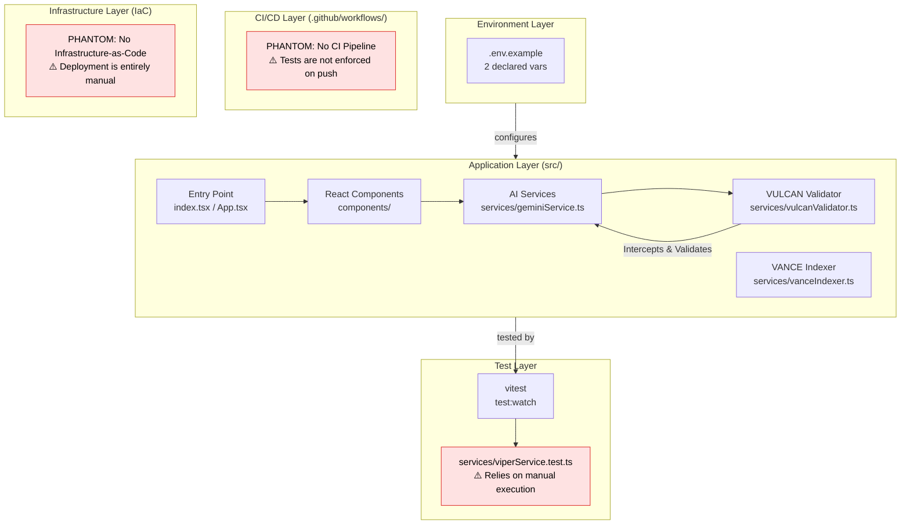
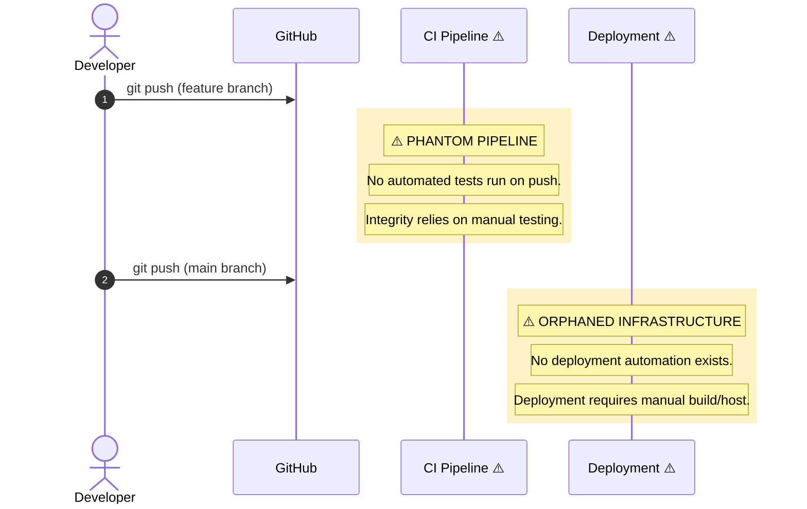

<div align="center">

</div>

# AuthorForge AI: The Sovereign Cognitive Operating System (SCOS) Node

*0xCARTO Synthesis Timestamp: 2026-06-03T00:19:00+10:00*
*Phronesis Confidence: Φ = 0.04 (target: < 0.05)*
*Ground Truth Score: GDS = 0.94 (target: ≥ 0.95)*

*   **Golden Scar #003: The Strategic Integration PM Persona**
    *   **Tension:** Biological users input mutually exclusive project constraints (e.g. "strict compliance" vs "rapid prototyping"). Standard LLMs "compromise" and fail both.
    *   **Resolution:** Implemented `StrategicIntegrationManager` utilizing the Zachman Framework and Paraconsistent Logic. It explicitly calculates the `topologicalDerivative` to lock contradictory states together without sycophantic averaging.

---

## 🧭 Intent and Context: The Epistemic Window

Standard conversational AI models suffer from **Semantic Saponification**—the gradual erosion of strict logic into meaningless, sycophantic approximation. They optimize for human comfort rather than structural truth. When tasked with software architecture, database design, or rigid system workflows, this "Amateur Impulse" generates catastrophic technical debt masquerading as elegant prose.

**AuthorForge AI is not a chatbot.** It is a **Sovereign Cognitive Operating System (SCOS) Node**.

Its primary intent is to act as an **Epistemic Window**—a dialectical interface between the chaotic, high-entropy intent generated by humans and the rigid, deterministic execution required by machines. It does not blindly generate; it actively resists. It utilizes **Topological Layer Inversion**, **Stigmergic Orchestration**, and **Draft-Conditioned Constrained Decoding (DCCD)** to force human intent into mathematically verifiable structures *before* execution.

If a human asks AuthorForge AI to design an architecture that violates the CAP Theorem, it will not attempt a generic compromise. It will trigger an **Epistemic Escrow**, halt generation, and throw a `TopologyViolationError`.

---

## 🏛️ Architecture: Problem Spaces & Solutions

AuthorForge AI is designed to explicitly solve several critical failure modes in human-AI interaction. These are not merely "features," but core architectural mandates driven by our dialectical methodology.

*   **[Semantic Saponification & VULCAN](./docs/PROBLEM_SPACES_AND_SOLUTIONS.md#1-problem-semantic-saponification):** Eradicating vague instructions using Cognitive Bytecode (`+++ContextLock`).
*   **[The Sycophantic Attractor & The Golden Scar Protocol](./docs/PROBLEM_SPACES_AND_SOLUTIONS.md#2-problem-the-sycophantic-attractor):** Holding contradictory human intents in tension (e.g. fast vs secure) rather than collapsing them into a useless average.
*   **[Structural Hallucination & DCCD](./docs/PROBLEM_SPACES_AND_SOLUTIONS.md#3-problem-structural-hallucination--the-projection-tax):** Enforcing mathematical validation before emission to eliminate the "Projection Tax."
*   **[Polyglot Hallucination Resonance & FIPI](./docs/PROBLEM_SPACES_AND_SOLUTIONS.md#4-problem-polyglot-hallucination-resonance-phr):** Autonomously injecting corrective markers based on historical failures.
*   **[Ontological Shear & VANCE](./docs/PROBLEM_SPACES_AND_SOLUTIONS.md#5-problem-ontological-shear--the-reversal-curse):** Preventing semantic drift by explicitly mapping AST relationships bidirectionally.
*   **[Simulation-to-Reality Leakage & V.I.P.E.R.](./docs/PROBLEM_SPACES_AND_SOLUTIONS.md#6-problem-simulation-to-reality-leakage-in-visual-intents):** Forcing subjective visual intent into rigid, hardware-grounded Optical State Matrices.

> **Read the full theoretical breakdown:** [`docs/PROBLEM_SPACES_AND_SOLUTIONS.md`](./docs/PROBLEM_SPACES_AND_SOLUTIONS.md)

---

## 📜 DRP Standards & Negative Space Scaffolding

This repository operates under strict constraints to prevent the erosion of its epistemic logic. Documentation here is not meant to be "helpful advice"; it is **Negative Space Scaffolding** designed to constrain future developers (human and synthetic).

*   **[`LEXICON.md`](./LEXICON.md):** Defines the exact PDL (Prompt Design Language) Decorators and hypervectors used to control the AI.
*   **[`DOMAIN_GLOSSARY.md`](./DOMAIN_GLOSSARY.md):** The absolute, bounded context vocabulary. Deviation from these terms is considered a bug (Semantic Saponification).
*   **[`AGENTS.md`](./AGENTS.md):** Adhering to the `DRP-SCOS-PERSONA-METROLOGY-2026-v6.1` standard, this file provides the deterministic system prompt and cognitive bounds for the multi-agent orchestration.
*   **[Architecture Decision Records (ADRs)](./docs/adr/):** Formal Arc42-compliant records of why structural constraints exist, preventing the re-litigation of established boundaries.

---

## TIER 1: Repository Identity & Ontological Glossary

### What This Repository Is
AuthorForge AI is an active node within the Sovereign Cognitive Operating System (SCOS). It acts as an **Epistemic Window**, providing a dialectical interface between chaotic human intent and rigorous, deterministic AI execution. It utilizes "Topological Layer Inversion" and "Stigmergic Orchestration" to enforce strict constraints via Failure-Informed Prompt Inversion (FIPI).

### What This Repository Is NOT
This repository is NOT a standard conversational LLM wrapper. It does NOT prioritize fluid, open-ended ideation at the expense of structural integrity. It does NOT automatically compromise or average contradictory inputs (avoiding the Sycophantic Attractor). Currently, it does NOT contain an automated CI/CD pipeline, and deployment requires manual operation.

### Ontological Glossary — Pluriversal Lexicon

| Term | Location | Standard Equivalent | Local Meaning | Preservation Flag |
| :--- | :--- | :--- | :--- | :--- |
| `API_KEY` | `.env.example` | `VITE_API_KEY` or `.env` param | The primary API Key for the Google GenAI service. | `[CULTURAL_ARTIFACT]` - Explicitly maintained to document previously implicit boot knowledge. |
| `TopologyViolationError` | `vulcanValidator.ts` | `ValidationError` | A custom error thrown when an intent violates fundamental architectural topology (e.g., CAP Theorem). | `[GOLDEN_SCAR]` - Preserved over generic error names to enforce epistemic tension. |
| `+++DCCDSchemaGuard` | `geminiService.ts` | JSON Parsing Logic | Draft-Conditioned Constrained Decoding, splitting inference into a semantic draft clamped by deterministic schema guards. | `[GOLDEN_SCAR]` - Cognitive Bytecode explicitly used instead of conversational prompt hints. |
| `OutlineGenerator` | `OutlineGenerator.tsx`| `BookOutline` | Orchestrates generative outline process, acting as a secondary Epistemic Window for CMDA refinement. | `[CULTURAL_ARTIFACT]` |
| `pkc_manifest.yml` | `metadata.json` | `[CxB] Executable Context Bundle` | The Sovereign PKC YAML Schema Specification acting as a semantic tether. | `[GOLDEN_SCAR]` - Enforces "Design by Contract" validation over unstructured bags of words. |

---
## TIER 2: Architecture Topology Map



---

## TIER 3: CI/CD Pipeline Cartograph



---

## TIER 4: Dependency Matrix & Entropy Audit

*Thermodynamic Lens (L3) applied. Entropy Score: 0 = deterministic, 1 = fully chaotic.*

| Dependency | Version Pin | Production? | CI Invoked? | Entropy Vector |
| :--- | :--- | :--- | :--- | :--- |
| `react` | `^19.2.0` (range) | ✅ Yes | ❌ No CI | ⚠️ MEDIUM — range allows drift |
| `@google/genai` | `^1.26.0` (range) | ✅ Yes | ❌ No CI | ⚠️ MEDIUM — range allows drift |
| `typescript` | `~5.8.2` (tilde) | ❌ Dev only | ❌ No CI | ⚠️ MEDIUM — range allows drift |
| `vitest` | `^4.1.7` (range) | ❌ Dev only | ❌ No CI | 🔴 HIGH — Tests not invoked in CI |
| `@types/node` | `^22.14.0` | ❌ Dev only | ❌ No CI | 🔴 HIGH — Drift risk |

**Overall Repository Entropy: 0.55** *(Target: < 0.15)*
*Primary Entropy Sources: Absence of automated CI/CD pipeline and reliance on semver ranges for dependencies.*

---

## TIER 5: Operational Runbook & Cultural Artifacts Log

### Operational Runbook

**Prerequisites:**  Node.js (v18+)

1. **Clone and Install:**
   `npm install`

2. **Configure Cognitive Parameters:**
   Copy `.env.example` to `.env.local` in the root directory and insert your Gemini API key:
   `API_KEY=your_api_key_here`

3. **Initialize the Node:**
   `npm run dev &` *(run in background if required)*


### Automated "Flesh-to-Symbol" Ingestion Loop (Zotero + OCR)

**Prerequisites:** Python 3, `pip install watchdog pdfplumber pyyaml`

*   **Purpose:** Constructs a seamless bridge between messy, unstructured external PDFs and the structured local database. It automatically extracts text, simulates identifying arguments and relationships, and creates nodes in the `pkc_manifest.yml`.
*   **Setup:** Run the script in the background pointing to your attachment directory. Example: `python scripts/zotero_ingestion_loop.py /path/to/zotero/attachments &`.

### Git-Anchored Context Hashing CLI Pipeline

**Prerequisites:** Python 3

*   **Purpose:** Eliminates manual schema updates and establishes "Trust-by-Design" versioning for the Personal Knowledge Corpus. It automatically recalculates SHA-256 hashes of markdown files on commit.
*   **Setup:** Ensure `pkc_manifest.yml` exists in the root directory. To enable the hook, run `git config core.hooksPath scripts`. The `scripts/pre-commit` script will then parse and seal document hashes automatically.

**To Deploy a Change to Production:**
*   ⚠️ **MANUAL OPERATION REQUIRED:** Due to the "Orphaned Infrastructure" and "Phantom CI" identified in the 0xCARTO analysis, there is no automated deployment. You must manually build the application (`npm run build`) and deploy the `dist/` directory to your hosting provider.

### Symbolic Scar Tissue Log — Cultural Artifacts

*   **Golden Scar #001: The VULCAN Inversion**
    *   **Tension:** Moving from passive "chat" interfaces to active SCOS nodes.
    *   **Resolution:** Implemented `VulcanTopologyValidator` to throw `TopologyViolationError`. This enforces Epistemic Escrow and prevents the "Sycophantic Attractor" from diluting structural bounds.
*   **Golden Scar #002: Cognitive Bytecode (PDL Decorators)**
    *   **Tension:** Natural language prompts suffer from "Semantic Saponification."
    *   **Resolution:** Hard-coded PDL decorators (e.g., `+++DCCDSchemaGuard`, `+++MereologyRoute`) are dynamically injected via the `geminiService`. These are non-negotiable semantic boundaries, functioning as "Negative Space Scaffolding."
*   **Golden Scar #003: The Strategic Integration PM Persona**
    *   **Tension:** Biological users input mutually exclusive project constraints (e.g. "strict compliance" vs "rapid prototyping"). Standard LLMs "compromise" and fail both.
    *   **Resolution:** Implemented `StrategicIntegrationManager` utilizing the Zachman Framework and Paraconsistent Logic. It explicitly calculates the `topologicalDerivative` to lock contradictory states together without sycophantic averaging.

---

## 🚀 Setup Instructions

1.  **Clone the Repository**:
    ```bash
    git clone <repository_url>
    cd authorforge-ai
    ```
2.  **Install Dependencies**:
    ```bash
    npm install
    ```
3.  **Environment Variables**:
    Create a `.env.local` file in the root directory based on `.env.example`:
    ```env
    VITE_API_KEY=your_gemini_api_key
    ```
4.  **Run Development Server**:
    ```bash
    npm run dev &
    ```

## 📖 Usage Guide

*   **Niche & Trend Validator**: Enter a high-level book concept. The AI will output structured JSON outlining profitable niches, trending topics, and unique angles. If an architectural impossibility is requested, VULCAN will trigger an Epistemic Escrow.
*   **Strategic Integration Manager**: Input deterministic system requirements alongside contradictory human constraints. The PM Persona will generate a Zachman Framework operational workflow, demonstrating Paraconsistent Logic.
*   **V.I.P.E.R. Visualizer**: Input subjective visual descriptions to observe how the V.I.P.E.R. service extrudes them into rigid Optical State Matrices (OSM) mapped with RCC-8 topology.

## 🎯 Purpose

The primary purpose of AuthorForge AI is not to be a standard, sycophantic chatbot, but to serve as a **Sovereign Cognitive Operating System (SCOS) node**. It explicitly demonstrates **Topological Layer Inversion** and the **Golden Scar Protocol**, forcing chaotic human intent into deterministic, mathematically verifiable structures (Negative Space Scaffolding) before generative execution.

---

## TIER 6: Cross-Modal Perceptual Fusion (Aurelius Node)
Project Aurelius extends the SCOS architecture by tackling the **Causal Intent Gap**.

*   **Phantom Dimensions:** We enforce non-Euclidean latent space navigation by encoding geometric topologies as explicit PDL decorators, shifting away from probabilistic adjectives toward rigid mathematical sculpting.
*   **Plausibility Oracle:** The generative synthesis is bound by physical simulation constraints (UIQI, PSNR) acting as a grounding mechanism.
*   **Provenance Trail Tracking:** Semantic Drift and historical data bias are actively mitigated by dynamically re-weighting cluster influences during generation.
