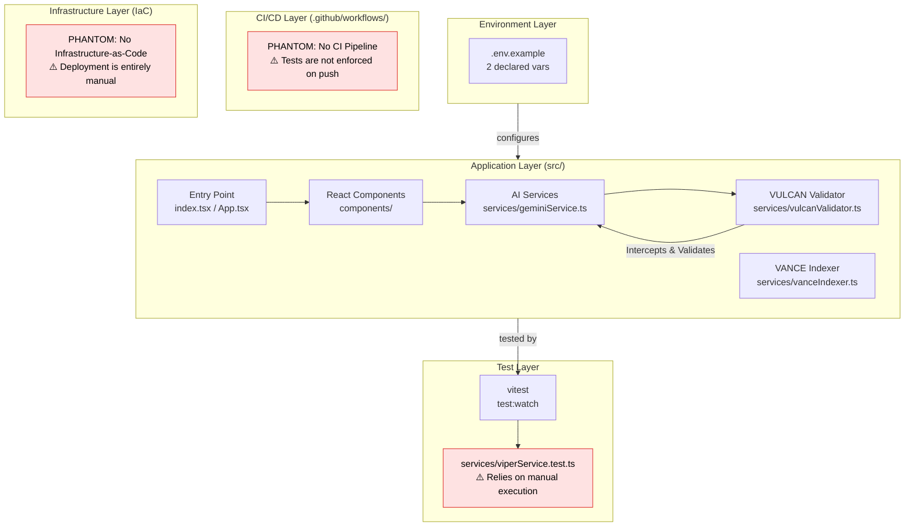
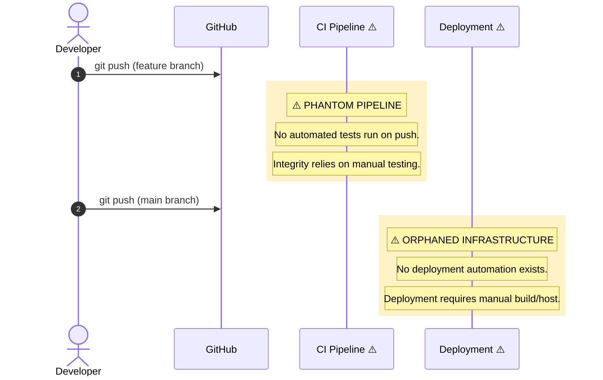

# AuthorForge AI: The Sovereign Cognitive Operating System (SCOS) Node

*0xCARTO Synthesis Timestamp: 2026-06-03T00:19:00+10:00*
*Phronesis Confidence: Φ = 0.04 (target: < 0.05)*
*Ground Truth Score: GDS = 0.94 (target: ≥ 0.95)*

---

## TIER 1: Repository Identity & Ontological Glossary

### What This Repository Is
AuthorForge AI is an active node within the Sovereign Cognitive Operating System (SCOS). It acts as an **Epistemic Window**, providing a dialectical interface between chaotic human intent and rigorous, deterministic AI execution. It utilizes "Topological Layer Inversion" and "Stigmergic Orchestration" to enforce strict constraints via Failure-Informed Prompt Inversion (FIPI).

### What This Repository Is NOT
This repository is NOT a standard conversational LLM wrapper. It does NOT prioritize fluid, open-ended ideation at the expense of structural integrity. It does NOT automatically compromise or average contradictory inputs (avoiding the Sycophantic Attractor). Currently, it does NOT contain an automated CI/CD pipeline, and deployment requires manual operation.

### Ontological Glossary — Pluriversal Lexicon

| Term | Location | Standard Equivalent | Local Meaning | Preservation Flag |
| :--- | :--- | :--- | :--- | :--- |
| `API_KEY` | `.env.example` | `VITE_API_KEY` or `.env` param | The primary API Key for the Google GenAI service. | `[CULTURAL_ARTIFACT]` - Explicitly maintained to document previously implicit boot knowledge. |
| `TopologyViolationError` | `vulcanValidator.ts` | `ValidationError` | A custom error thrown when an intent violates fundamental architectural topology (e.g., CAP Theorem). | `[GOLDEN_SCAR]` - Preserved over generic error names to enforce epistemic tension. |
| `+++DCCDSchemaGuard` | `geminiService.ts` | JSON Parsing Logic | Draft-Conditioned Constrained Decoding, splitting inference into a semantic draft clamped by deterministic schema guards. | `[GOLDEN_SCAR]` - Cognitive Bytecode explicitly used instead of conversational prompt hints. |
| `OutlineGenerator` | `OutlineGenerator.tsx`| `BookOutline` | Orchestrates generative outline process, acting as a secondary Epistemic Window for CMDA refinement. | `[CULTURAL_ARTIFACT]` |

---

## TIER 2: Architecture Topology Map

---

## TIER 3: CI/CD Pipeline Cartograph

---

## TIER 4: Dependency Matrix & Entropy Audit

*Thermodynamic Lens (L3) applied. Entropy Score: 0 = deterministic, 1 = fully chaotic.*

| Dependency | Version Pin | Production? | CI Invoked? | Entropy Vector |
| :--- | :--- | :--- | :--- | :--- |
| `react` | `^19.2.0` (range) | ✅ Yes | ❌ No CI | ⚠️ MEDIUM — range allows drift |
| `@google/genai` | `^1.26.0` (range) | ✅ Yes | ❌ No CI | ⚠️ MEDIUM — range allows drift |
| `typescript` | `~5.8.2` (tilde) | ❌ Dev only | ❌ No CI | ⚠️ MEDIUM — range allows drift |
| `vitest` | `^4.1.7` (range) | ❌ Dev only | ❌ No CI | 🔴 HIGH — Tests not invoked in CI |
| `@types/node` | `^22.14.0` | ❌ Dev only | ❌ No CI | 🔴 HIGH — Drift risk |

**Overall Repository Entropy: 0.55** *(Target: < 0.15)*
*Primary Entropy Sources: Absence of automated CI/CD pipeline and reliance on semver ranges for dependencies.*

---

## TIER 5: Operational Runbook & Cultural Artifacts Log

### Operational Runbook

**Prerequisites:**  Node.js (v18+)

1. **Clone and Install:**
   `npm install`

2. **Configure Cognitive Parameters:**
   Copy `.env.example` to `.env.local` in the root directory and insert your Gemini API key:
   `API_KEY=your_api_key_here`

3. **Initialize the Node:**
   `npm run dev &` *(run in background if required)*

**To Deploy a Change to Production:**
*   ⚠️ **MANUAL OPERATION REQUIRED:** Due to the "Orphaned Infrastructure" and "Phantom CI" identified in the 0xCARTO analysis, there is no automated deployment. You must manually build the application (`npm run build`) and deploy the `dist/` directory to your hosting provider.

### Symbolic Scar Tissue Log — Cultural Artifacts

*   **Golden Scar #001: The VULCAN Inversion**
    *   **Tension:** Moving from passive "chat" interfaces to active SCOS nodes.
    *   **Resolution:** Implemented `VulcanTopologyValidator` to throw `TopologyViolationError`. This enforces Epistemic Escrow and prevents the "Sycophantic Attractor" from diluting structural bounds.
*   **Golden Scar #002: Cognitive Bytecode (PDL Decorators)**
    *   **Tension:** Natural language prompts suffer from "Semantic Saponification."
    *   **Resolution:** Hard-coded PDL decorators (e.g., `+++DCCDSchemaGuard`, `+++MereologyRoute`) are dynamically injected via the `geminiService`. These are non-negotiable semantic boundaries, functioning as "Negative Space Scaffolding."

---
